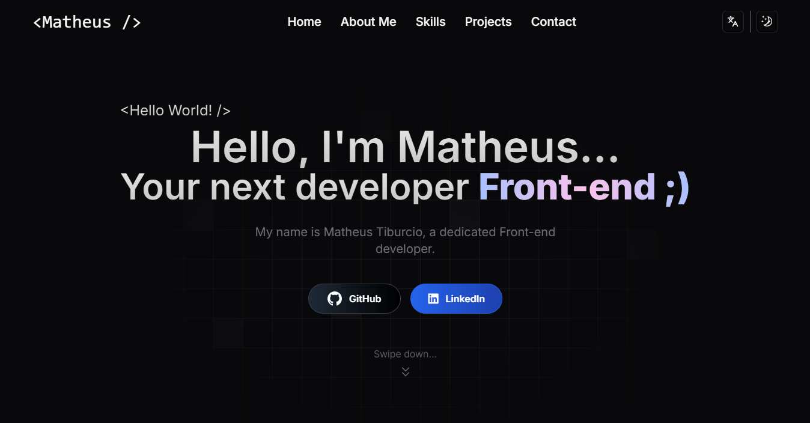

# 🌐 My Web Portfolio

Welcome to the repository of my personal portfolio! This project was developed to showcase my skills, projects, and professional information.

## ✨ Demo

Check out my portfolio below:

👉 **[Click here to visit the live site](https://matheustiburcio.vercel.app/)**

## 📋 Features

- **Home page:** Introduction with an attractive visual and smooth animations.
- **About me:** Personal information, skills, and experience.
- **Skills:** A dedicated section to highlight the technologies and tools I use.
- **Projects:** List of projects with descriptions and links to repositories or live demos.
- **Contact:** Form to send messages directly or links to social media.

## 🛠️ Technologies Used

- **Frontend:** ReactJS, Next.js, Tailwind CSS, Shadcn UI
- **Design Tools:** Figma
- **Others:** HTML, CSS, JavaScript, TypeScript

## 🤝 Contributions

Contributions are welcome! Feel free to open issues or submit pull requests.

## 📧 Contact

If you want to get in touch, send an email to [matheusgtiburcio@gmail.com](mailto:matheusgtiburcio@gmail.com) or find me on [LinkedIn](https://www.linkedin.com/in/matheus-tiburcio-82a337276/).

  

  <h3><em>Thank you for visiting my portfolio<em><h3>

